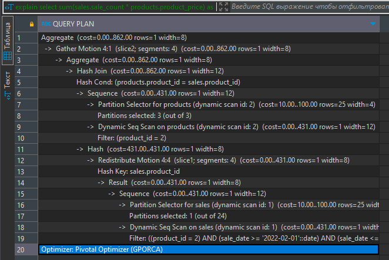

### Задание

Создайте таблицу-фактов о продажах произвольных товаров. При создании таблицы укажите поле для разделения таблицы по сегментам. Учитывайте, что правильные сегменты должны быть одинакового размера и не иметь пустых записей. Также при создании таблицы выберите поле для партиционирования. Лучшее поле для создания партиции — поле с единицей времени (год, месяц, день и т.д.).

Создайте таблицу-измерение, в которой отражены стоимость и название товара, а также связь с таблицей-фактов из предыдущего шага.

Заполните таблицы минимальными данными. Включите оптимизатор GP. 

Напишите запрос, который рассчитывает сумму продаж определенного товара за определенную единицу времени. 

Напечатайте план предыдущего запроса. 

В качестве результата необходимо предоставить код всех запросов и план последнего запроса. 

***

### Решение

```sql
CREATE table if not exists products ( 
	product_id int,
	product_name varchar(64),
	product_category_id int,
	product_price float )
DISTRIBUTED BY (product_id)
PARTITION BY LIST (product_category_id)
( partition category_1 values (1),
	partition category_2 values (2),
	partition category_3 values (3)
)
	
insert into products values 
(1, 'product_1' , 1, 10.00),
(2, 'product_2' , 2, 15.00),
(3, 'product_3' , 2, 20.00),
(4, 'product_3' , 3, 15.00);


CREATE table if not exists sales ( 
	sales_id int,
	product_id int,
	sale_date DATE,
	sale_count int )
DISTRIBUTED BY (sales_id)
PARTITION BY RANGE (sale_date)
( START (date '2022-01-01') INCLUSIVE
   END (date '2023-12-31') EXCLUSIVE
   EVERY (INTERVAL '1 month') );
	
insert into sales values 
(1, 1 , '2022-01-01', 1),
(2, 2 , '2022-01-01', 1),
(3, 3 , '2022-02-03', 2),
(4, 2 , '2022-02-05', 1),
(5, 2 , '2022-02-07', 1),
(6, 1 , '2022-03-01', 2),
(7, 4 , '2022-03-11', 1),
(8, 2 , '2022-05-10', 7),
(9, 1 , '2022-05-13', 2),
(10, 2 , '2022-12-01', 1),
(11, 2 , '2022-12-03', 3),
(12, 1 , '2022-12-31', 2);

set optimizer = on;

-- explain
select 
	sum(sales.sale_count * products.product_price) as sales
from sales
join products on sales.product_id = products.product_id 
where sales.product_id = 2 and sale_date between to_date('20220201', 'YYYYMMDD') and to_date('20220201', 'YYYYMMDD') + interval '1 month - 1 second'
```

План запроса: 
